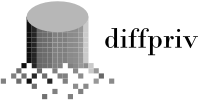

---
output:
  md_document:
    variant: markdown_github
---

<!-- README.md is generated from README.Rmd. Please edit that file -->

```{r, echo = FALSE}
knitr::opts_chunk$set(
  collapse = TRUE,
  comment = "#>",
  fig.path = "README-"
)
set.seed(5038563) # for reproducibility
```

# diffpriv 

[](https://travis-ci.org/brubinstein/diffpriv)
[](https://codecov.io/github/brubinstein/diffpriv?branch=master)

## Overview

The `diffpriv` package makes privacy-aware data science in R easy. 
`diffpriv` implements the formal framework of differential privacy:
differentially-private mechanisms can safely release to untrusted third parties:
statistics computed, models fit, or arbitrary structures derived on 
privacy-sensitive data. Due to the worst-case nature of the framework, mechanism
development typically requires involved theoretical analysis. `diffpriv` offers 
a turn-key approach to differential privacy by automating this process with
sensitivity sampling in place of theoretical sensitivity analysis.

## Installation

Obtaining `diffpriv` is easy. From within R:

```{r eval=FALSE}
##  Install the development version of diffpriv from GitHub:
install.packages("devtools")
devtools::install_github("brubinstein/diffpriv")
```

## Example

A typical example in differential privacy is privately releasing a simple 
`target` function of privacy-sensitive input data `X`. Say the mean:

```{r example-1}
## a target function we'd like to run on private data X, releasing the result
target <- function(X) mean(X)
```

First load the `diffpriv` package (installed as above) and construct a 
chosen differentially-private mechanism for privatizing `target`.

```{r example-2}
## target seeks to release a scalar numeric, so we'll use the Laplace 
## mechanism--a standard generic mechanism for numeric responses
library(diffpriv)
mech <- DPMechLaplace(target = target, dim = 1)
```

To run `mech` on some `X` we must first determine the sensitivity of `target` 
to small changes to input dataset. We could either assume bounded data then do
the math, or we could use sensitivity sampling: repeated probing of `target` to
estimate sensitivity automatically. We must specify a distribution `distr` for 
generating the probe datasets.

```{r example-3}
## set a dataset sampling distribution, then estimate target sensitivity with
## sufficient samples for subsequent mechanism responses to achieve random
## differential privacy with confidence 1-gamma
distr <- function(n) rnorm(n)
mech <- sensitivitySampler(mech, oracle = distr, n = 5, gamma = 0.1)
mech@sensitivity
```

Finally we can produce private responses on an actual dataset `X`, displayed
alongside the non-private response for comparison:

```{r example-4}
X <- list(0.328,-1.444,-0.511,0.154,-2.062) # length is sensitivitySampler() n
r <- releaseResponse(mech, privacyParams = DPParamsEps(epsilon = 1), X = X)
cat("Private response r$response:   ",   r$response,
    "\nNon-private response target(X):", target(X))
```

## Getting Started

The above example demonstrates the main components of `diffpriv`:

* Virtual class `DPMech` for generic mechanisms that captures the non-private
  `target` and releases privatized responses from it. Current subclasses
    + `DPMechLaplace`: the Laplace mechanism for releasing numeric responses; 
      and
    + `DPMechExponential`: the exponential mechanism for privately 
      optimizing over finite sets (which need not be numeric).
* Class `DPParamsEps` and subclasses for encapsulating privacy parameters.
* `sensitivitySampler()` method of `DPMech` subclasses estimates target 
  sensitivity necessary to run `DPMech` generic mechanisms. This provides an
  easy alternative to exact sensitivity bounds requiring mathematical analysis.
  The sampler repeatedly probes `target` to estimate its sensitivity to data
  perturbation. Running mechanisms with obtained sensitivities yield slightly
  weaker random differential privacy.

Read the [package vignette](inst/doc/diffpriv.pdf) for more.

## Citing the Package

`diffpriv` is an open-source package offered with a permissive MIT License. 
Please acknowledge use of `diffpriv` by citing the paper on the sensitivity 
sampler:

> Benjamin I. P. Rubinstein and Francesco Alda. "Pain-Free Random Differential 
> Privacy with Sensitivity Sampling", accepted into the 34th International
> Conference on Machine Learning (ICML'2017), May 2017.

Other relevant references to cite depending on usage:

* **Differential privacy and the Laplace mechanism:** 
  Cynthia Dwork, Frank McSherry, Kobbi Nissim, and Adam Smith. "Calibrating 
  noise to sensitivity in private data analysis." In Theory of Cryptography 
  Conference, pp. 265-284. Springer Berlin Heidelberg, 2006.
* **The exponential mechanism:** Frank McSherry and Kunal Talwar. "Mechanism 
  design via differential privacy." In the 48th Annual IEEE Symposium on 
  Foundations of Computer Science (FOCS'07), pp. 94-103. IEEE, 2007.
* **Random differential privacy:** Rob Hall, Alessandro Rinaldo, and Larry 
  Wasserman. "Random Differential Privacy." Journal of Privacy and 
  Confidentiality, 4(2), pp. 43-59, 2012. 
